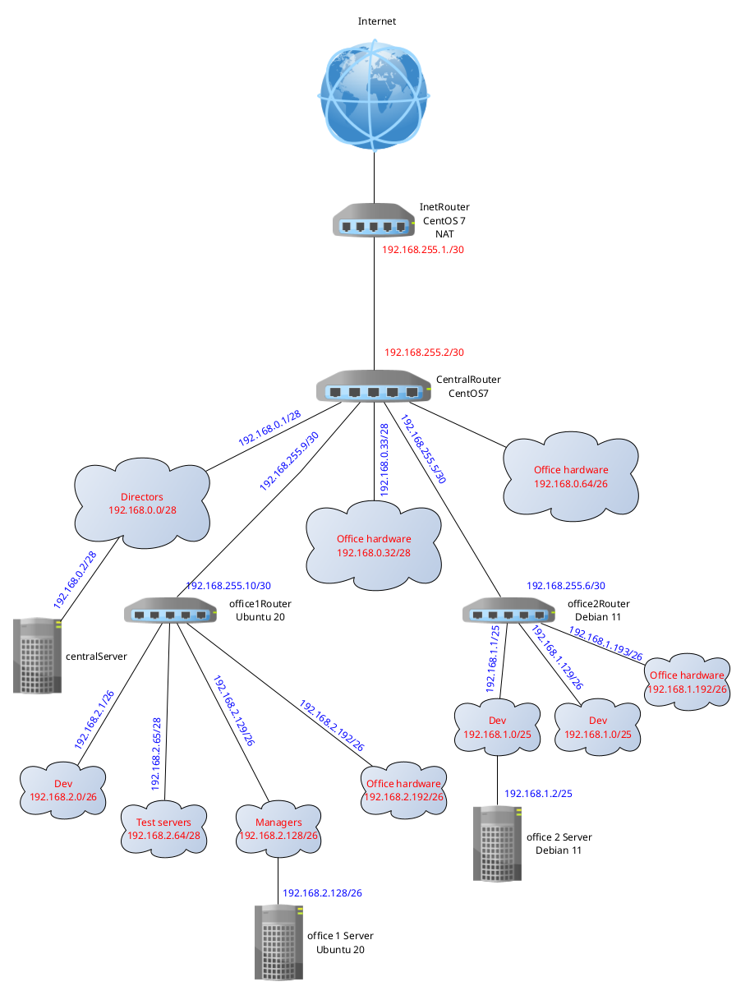

<h1>Архитектура сетей</h1>

<h2>Развернуть стенд в Vagrant</h2>

 В фйле Vagrantfile создаются необходимые ВМ для демонстрации выполнения домашнего задани. Небольшое отличие от предлагаемого стенда, это версия CentOS 7, вместо CentOS 6, не поддерживаемой в данный момент.

<h2>Теоретическа часть</h2>

<ul>
<li>Найти свободные подсети</li>
<li>Посчитать сколько узлов в каждой подсети, включая свободные</li>
<li>Указать Broadcast-адрес для каждой подсети</li>
<li>Проверить, нет ли ошибок при разбиении сетей</li>
</ul>

<table border='1'>
    <tr>
        <th>Name</th>
        <th>Network</th>
        <th>Netmask</th>
        <th>Number</th>
        <th>HostMin</th>
        <th>HostMax</th>
        <th>Broadcast</th>
    </tr>
    <tr>
        <th align="center" colspan="7" >Central Network</th>
    </tr>
    <tr>
        <td>Directors</td>
        <td>192.168.0.0/28</td>
        <td>255.255.255.240</td>
        <td>14</td>
        <td>192.168.0.1</td>
        <td>192.168.0.14</td>
        <td>192.168.0.15</td>
    </tr>
    <tr>
        <td>Office hardware</td>
        <td>192.168.0.32/28</td>
        <td>255.255.255.240</td>
        <td>14</td>
        <td>192.168.0.33</td>
        <td>192.168.0.46</td>
        <td>192.168.0.47</td>
    </tr>
    <tr>
        <td>Wifi(mgt network)</td>
        <td>192.168.0.64/26</td>
        <td>255.255.255.192</td>
        <td>62</td>
        <td>192.168.0.65</td>
        <td>192.168.0.126</td>
        <td>192.168.0.127</td>
    </tr>
    <tr>
        <th align="center" colspan="7" >Office 1 network</th>
    </tr>
    <tr>
        <td>Dev</td>
        <td>192.168.2.0/26</td>
        <td>255.255.255.192</td>
        <td>62</td>
        <td>192.168.2.1</td>
        <td>192.168.2.62</td>
        <td>192.168.2.63</td>
    </tr>
    <tr>
        <td>Test</td>
        <td>192.168.2.64/26</td>
        <td>255.255.255.192</td>
        <td>62</td>
        <td>192.168.2.65</td>
        <td>192.168.2.126</td>
        <td>192.168.2.127</td>
    </tr>
    <tr>
        <td>Managers</td>
        <td>192.168.2.128/26</td>
        <td>255.255.255.192</td>
        <td>62</td>
        <td>192.168.2.129</td>
        <td>192.168.2.190</td>
        <td>192.168.2.191</td>
    </tr>
    <tr>
        <td>Office Hardware</td>
        <td>192.168.0.192/26</td>
        <td>255.255.255.192</td>
        <td>62</td>
        <td>192.168.2.193</td>
        <td>192.168.2.254</td>
        <td>192.168.2.255</td>
    </tr>
    <tr>
        <th align="center" colspan="7" >Office 2 network</th>
    </tr>
    <tr>
        <td>Dev</td>
        <td>192.168.1.0/25</td>
        <td>255.255.255.128</td>
        <td>126</td>
        <td>192.168.1.1</td>
        <td>192.168.1.126</td>
        <td>192.168.1.127</td>
    </tr>
    <tr>
        <td>Test</td>
        <td>192.168.0.128/26</td>
        <td>255.255.255.192</td>
        <td>62</td>
        <td>192.168.1.129</td>
        <td>192.168.1.190</td>
        <td>192.168.1.191</td>
    </tr>
    <tr>
        <td>Office</td>
        <td>192.168.1.192/26</td>
        <td>255.255.255.192</td>
        <td>62</td>
        <td>192.168.1.193</td>
        <td>192.168.1.254</td>
        <td>192.168.1.255</td>
    </tr>
    <tr>
        <th align="center" colspan="7">InetRouter - CentralRouter network</th>
    </tr>
    <tr>
        <td>Inet - central</td>
        <td>192.168.255.0/30</td>
        <td>255.255.255.252</td>
        <td>2</td>
        <td>192.168.255.1</td>
        <td>192.168.255.2</td>
        <td>192.168.255.3</td>
    </tr>
</table>

После создания таблицы топологии, определили, что ошибок нет. Остались свободные сети:

<ul>
<li>192.168.0.1/28</li>
<li>192.168.0.48/28</li>
<li>192.168.0.128/25</li>
<li>192.168.255.64/26</li>
<li>192.168.255.32/27</li>
<li>192.168.255.8/29</li>
<li>192.168.255.4/30</li>
</ul>

<h2>Практическая часть</h2>

Изучив топологию сети, можем построить полную схему сети

</img>

Исходя из схемы, нам необходимо создать дополнительно две сети: office1Router <=> centralRouter и office2Router<=>centralRouter

Так же необходимо создать еще 4 хоста:

<ul>
<li>office1Router</li>
<li>office2Router</li>
<li>office1Server</li>
<li>office2Server</li>
</ul>

Все необходимые изменения допишем в наш Vagrantfile

<h2>Настройка NAT.</h2>

В Vagrantfile уже имеются настройки NAT для iptables, но они не сохранятся после перезагрузки сервера. Можно настроить правила вручную, а можно с помощью Ansible. Воспользуемся вторым вариантом 

В блоке Setup NAT устанавливаются настройки NAT для iptables на inetRouter

Set up routers, устанавливается настройка маршрутизации транзитных пакетов для роутеров

Далее в disable default route, default gateway for connected to inetRouter и default gateway for connected to centralRouter устанавливаются маршруты по умолчанию для ВМ СentOS 

В Setup rote устанавливаются статические маршруты

Проверим путь с которогго теперь рошел трафик

<pre>traceroute to 8.8.8.8 (8.8.8.8), 30 hops max, 60 byte packets
 1  _gateway (192.168.2.129)  0.443 ms  0.395 ms  0.364 ms
 2  192.168.255.9 (192.168.255.9)  2.052 ms  1.943 ms  1.862 ms
 3  192.168.255.1 (192.168.255.1)  4.252 ms  3.549 ms  3.197 ms
 4  * * *
 ...
</pre>

Все, ВМ завязаны в общую сеть
