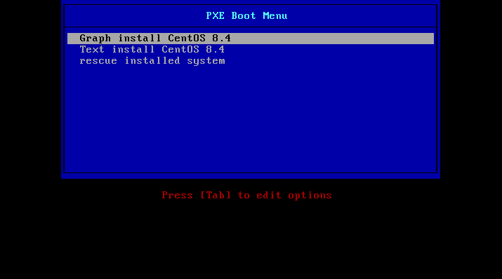
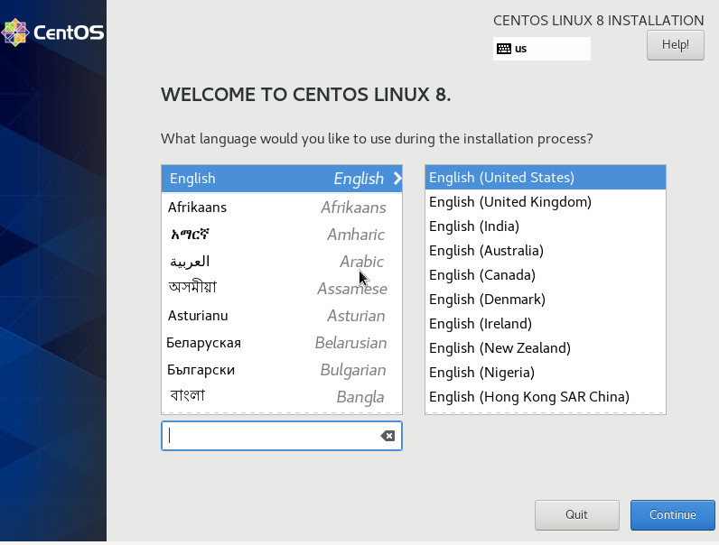

<h1>DHCP. PXE. Настройка PXE сервера для автоматической установки</h1>

<b>Цель:</b>Отработать навыки установки и настройки DHCP, TFTP, PXE загрузчика и автоматической загрузки

<b>Vagrantfile</b> - разворачивается две ВМ. На одной будет pxe-сервер, на другой будет разворачиваться ОС с этого сервера

<b>/playbooks</b> - плэйбук с сопутствующими конфигурационными файлами и шаблонами

<h2>Настройка web-сервера</h2>

Вся настройка осуществляется с помощью playbook

<ul>
<li>Устанавливается web-сервер Apache</li>
<li>Скачивается образ CentOS 8.4.2105</li>
<li>Монтируется образ</li>
<li>Создается каталог /iso и копируется туда содержимое образа</li>
</ul>

<h2>Настройка TFTP-сервера</h2>

Настройка производится так же в playbook

<ul>
<li>Устанавливается tftp-сервер</li>
<li>Создается каталог для меню загрузки</li>
<li>Создается файл-меню (<a src='playbooks/templates/default'>default</a>)
</ul>

<h2>Настройка DHCP-сервера</h2>
<ul>
<li>Установка DHCP-сервера</li>
<li>Настройка конфигурационного файла (<a src='playbooks/templates/dhcpd.conf'>dhcpd.conf</a>)</li>
</ul>

После проведения всех настроек, будет настроен сервер, необходимый для установки ОС по сети с помощью PXE-сервера

</img>

При выборе ручного варианта установки, устанавливать систему в графическом режиме вручную

</img>

Для того, чтобы каждый раз не устанавливать все вручную, можно это автоматизировать с помощью kickstart file (<a src='playbooks/templates/ks.cfg'>ks.cfg</a>). После внесения всех необходимых настроек, установка будет проходить в автоматическом режиме

