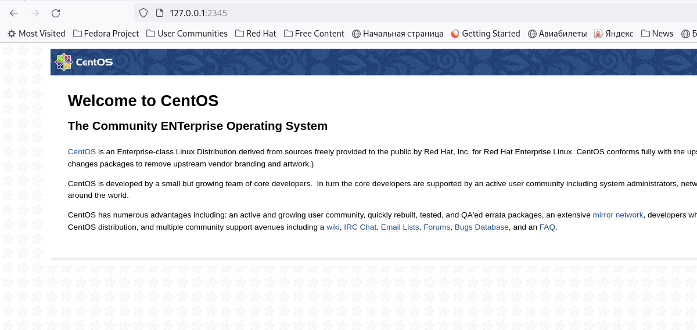

<h1>Фильтрация трафика - firewalld, iptables</h1>

<b>Цель:</b>

<ul>
<li>Настраивать файрволл с импользованием iptables/firewalld;</li>
<li>Настраивать NAT;</li>
<li>Пробрасывать порты;</li>
<li>Настраивать взаимодействие с роутингом;</li>
<li>Понимать работу таблиц и цепочек</li>
</ul>
 

<b><a src='Vagrantfile'>Vagrantfile</a></b> - Разворачивание и установка параметров для ВМ.

<b><a src='playbooks'>playbooks</a></b> - Плэйбук для настройки ВМ

<b><a src='_knock_script.sh'>_knock_script.sh</a></b> - скрипт, который запускает nmap с определенными параметрами. Правило запуска: "_knock_script.sh ip_adress port ... port"

<h2>Реализовать knocking port</h2>

Реализовывать knocking port будем с помощью iptables. Для этого на целевом хосте (inetRouter) внесем правила в iptables (<a src='playbooks/templates/ir.iptables.rules'>ir.iptables.rules</a>).

После применения всех правил, проверяем работу

<pre>$ ssh vagrant@192.168.56.2
ssh: connect to host 192.168.56.2 port 22: Connection timed out
</pre>

Соединение в лоб, отваоивается по таймауту. Для того, чтобы постучать в порты, воспользуемся утилитой knock

<pre># knock 192.168.56.2 8881:tcp 7777:tcp 9991:tcp
# ssh vagrant@192.168.56.2
vagrant@192.168.56.2&apos;s password: 
Last login: Sat Sep 23 14:43:29 2023 from 192.168.56.1
[vagrant@inetRouter ~]$ 

</pre>

<h2>Добавить InetRouter2</h2>

ВМ InetRouter2 добавляется в VagrantFile, там же пробрасывается порт 8080 на порт 2345 хостовой машины

<h2>Запустить nginx на CentralServer</h2>

Создание ВМ в Vagrantfile, установка и запуск nginx в <a src='playbooks/provision.yml'>provision.yml</a>

<h2>Пробросить порт на inetRouter2</h2>

CentralServer находится в общей подсети с CentralRouter, который в свою очередь находится в общей подсети с InetRouter2. В правилах iptables на InetRouter2 установлена переадресация пакетов с 8080 на 80 CentralServer. В свою очередь мы пробросили порт 8080 на порт 2345 локальной машины. Теперь если с нее зайти по адресу: 127.0.0.1:2345, то попадем на 80 порт CentralServer

