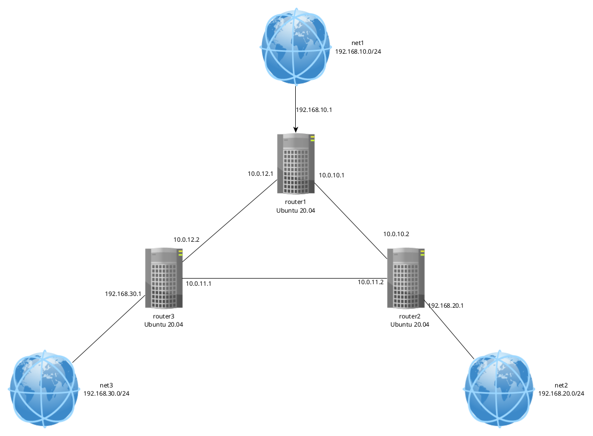

<h1>Статическая и динамическая маршрутизация OSPF</h1>

<b>Цель: </b>Создать домашнюю сетевую лабораторию. НАучиться настраивать протокол OSPF в Linux-based системах

<a src='Vagrantfile'>Vagrantfile</a> - разворачивается 3 ВМ для демонстрации задания

<a src='playbook'>playbook</a>- плэйбук и сопутствующая конфигурация для настройки серверов

<h2>Разворачиваем 3 ВМ</h2>

Для настраивания OSPF, необходимо развернуть ВМ, соединенными между собой разнми VLAN, а также иметь одну (или несколько) дополнительных сетей, к которым сформируем маршруты. Топология сети представлена ниже:

В Vagrantfile создается 3 ВМ, соединенных между собой сетями (10.0.10.0/30, 10.0.11.0/30 и 10.0.12.0/30). У каждого роутера есть дополнительная сеть:

<ul>
    <li>router1 - 192.168.10.0/24</li>
    <li>router2 - 192.168.20.0/24</li>
    <li>router3 - 192.168.30.0/24</li>
</ul>

Для изучения сети, устанавливаются дополнительные программы: <i>vim, traceroute, tcpdump, net-tools</i>

<h2>Настройка OSPF между машинами на базе Quagga</h2>

Так как пакет Quagga остановил свое развитие в 2018 году. Будем использовать пакет FRR, основанный на Quagga и продолжающий свое развитие

Процесс установки следующий:

<ul>
    <li>Отключаем фаерволл ufw</li>
    <li>Добавляем ключ gpg и репозиторий с пакетом FRR</li>
    <li>Обновлякм пакеты и устанавливаем FRR</li>
    <li>Включаем маршрутизацию транзитных пакетов</li>
    <li>Включаем демон ospfd в FRR. Для этого в файле <a src='playbook/templates/daemons'>/etc/frr/daemons</a> и меняем в нем параметры для пакетов zebra и ospfd на yes</li>
    <li>Настраиваем OSPF с помощью конфигурационного файла /etc/frr/frr.conf (примеры для каждого хоста в <a src='playbook/templates'>templates</a>, jinja не осилил)</li>
    <li>Перезапускаем FRR и добавляем его в автозагрузку</li>
    <li>Проверяем, что OSPF перезапустился без ошибок</li>
    <pre># systemctl status frr
<b>●</b> frr.service - FRRouting
     Loaded: loaded (/lib/systemd/system/frr.service; enabled; vendor preset: enabled)
     Active: <b>active (running)</b> since Sun 2023-09-24 16:27:51 UTC; 3min 45s ago
       Docs: https://frrouting.readthedocs.io/en/latest/setup.html
    Process: 20417 ExecStart=/usr/lib/frr/frrinit.sh start (code=exited, status=0/SUCCESS)
   Main PID: 20437 (watchfrr)
     Status: &quot;FRR Operational&quot;
      Tasks: 10 (limit: 1117)
     Memory: 20.9M
     CGroup: /system.slice/frr.service
             ├─20437 /usr/lib/frr/watchfrr -d -F traditional zebra mgmtd ospfd staticd
             ├─20452 /usr/lib/frr/zebra -d -F traditional -A 127.0.0.1 -s 90000000
             ├─20457 /usr/lib/frr/mgmtd -d -F traditional -A 127.0.0.1
             ├─20459 /usr/lib/frr/ospfd -d -F traditional -A 127.0.0.1
             └─20462 /usr/lib/frr/staticd -d -F traditional -A 127.0.0.1

Sep 24 16:27:46 router1 ospfd[20459]: [VTVCM-Y2NW3] Configuration Read in Took: 00:00:00
Sep 24 16:27:46 router1 frrinit.sh[20469]: [20469|ospfd] Configuration file[/etc/frr/frr.conf] processing failure: 2
Sep 24 16:27:46 router1 watchfrr[20437]: <b>[ZJW5C-1EHNT] restart all process 20438 exited with non-zero status 2</b>
Sep 24 16:27:51 router1 watchfrr[20437]: <b>[QDG3Y-BY5TN] mgmtd state -&gt; up : connect succeeded</b>
Sep 24 16:27:51 router1 watchfrr[20437]: <b>[QDG3Y-BY5TN] staticd state -&gt; up : connect succeeded</b>
Sep 24 16:27:51 router1 watchfrr[20437]: <b>[QDG3Y-BY5TN] ospfd state -&gt; up : connect succeeded</b>
Sep 24 16:27:51 router1 watchfrr[20437]: <b>[QDG3Y-BY5TN] zebra state -&gt; up : connect succeeded</b>
Sep 24 16:27:51 router1 watchfrr[20437]: <b>[KWE5Q-QNGFC] all daemons up, doing startup-complete notify</b>
Sep 24 16:27:51 router1 frrinit.sh[20417]:  * Started watchfrr
Sep 24 16:27:51 router1 systemd[1]: Started FRRouting.
</pre>
    <li>Проверим доступность сетей с хоста router1</li>

<pre># ping 192.168.30.1 -c5
PING 192.168.30.1 (192.168.30.1) 56(84) bytes of data.
64 bytes from 192.168.30.1: icmp_seq=1 ttl=64 time=0.349 ms
64 bytes from 192.168.30.1: icmp_seq=2 ttl=64 time=0.411 ms
64 bytes from 192.168.30.1: icmp_seq=3 ttl=64 time=0.314 ms
64 bytes from 192.168.30.1: icmp_seq=4 ttl=64 time=0.464 ms
64 bytes from 192.168.30.1: icmp_seq=5 ttl=64 time=0.710 ms

--- 192.168.30.1 ping statistics ---
5 packets transmitted, 5 received, 0% packet loss, time 4081ms
rtt min/avg/max/mdev = 0.314/0.449/0.710/0.140 ms
</pre>
<li>Запустим трассировку</li>

<pre># traceroute 192.168.30.1
traceroute to 192.168.30.1 (192.168.30.1), 30 hops max, 60 byte packets
 1  192.168.30.1 (192.168.30.1)  0.537 ms  0.498 ms  0.487 ms
</pre>

<li>Отключим один интерфейс, который смотрит на соседа, и посмотрим после этого маршрут к нему</li>
<pre># traceroute 192.168.30.1
traceroute to 192.168.30.1 (192.168.30.1), 30 hops max, 60 byte packets
 1  10.0.10.2 (10.0.10.2)  0.692 ms  0.636 ms  0.610 ms
 2  192.168.30.1 (192.168.30.1)  0.970 ms  1.007 ms  1.677 ms
</pre>

Видно, что сеть 192.168.30.0/24 осталась нам доступна и доступ к ней иет через другого соседа

<li>Посмотрим какие маршруты нам видны в vtysh</li>
<pre>router1# show ip route ospf
Codes: K - kernel route, C - connected, S - static, R - RIP,
       O - OSPF, I - IS-IS, B - BGP, E - EIGRP, N - NHRP,
       T - Table, v - VNC, V - VNC-Direct, A - Babel, F - PBR,
       f - OpenFabric,
       &gt; - selected route, * - FIB route, q - queued, r - rejected, b - backup
       t - trapped, o - offload failure

O   10.0.10.0/30 [110/1000] is directly connected, enp0s8, weight 1, 00:03:55
O&gt;* 10.0.11.0/30 [110/1045] via 10.0.10.2, enp0s8, weight 1, 00:03:55
O&gt;* 10.0.12.0/30 [110/1090] via 10.0.10.2, enp0s8, weight 1, 00:03:55
O   192.168.10.0/24 [110/100] is directly connected, enp0s10, weight 1, 00:41:10
O&gt;* 192.168.20.0/24 [110/1045] via 10.0.10.2, enp0s8, weight 1, 00:03:55
O&gt;* 192.168.30.0/24 [110/1145] via 10.0.10.2, enp0s8, weight 1, 00:03:55
</pre>
</ul>

<h2>Настройка ассиметричного роутинга.</h2>

Вся настройка происходит в плэе <a src='playbook/config_assymetric.yml'>config_aasymetric.yml</a>. В нем выполняются следующие шаги:

<ul>
    <li>Включение блокировки ассиметричной маршрутизации</li>
    <li>Меняем "стоимость интерфейса" enp0s8 на router1, который смотрит на router2 (см.<a src='playbook/templates/frr.conf.cost.router1'>frr.conf.cost.router1</a> )</li> 
    <li>Перезагружаем службу frr</li>
</ul>

Теперь можно увидеть, что маршрут к 192.168.30.1 пойдет через router2

<pre>router1# show ip route osfp
% Unknown command: show ip route osfp
router1# show ip route ospf
Codes: K - kernel route, C - connected, S - static, R - RIP,
       O - OSPF, I - IS-IS, B - BGP, E - EIGRP, N - NHRP,
       T - Table, v - VNC, V - VNC-Direct, A - Babel, F - PBR,
       f - OpenFabric,
       &gt; - selected route, * - FIB route, q - queued, r - rejected, b - backup
       t - trapped, o - offload failure

O   10.0.10.0/30 [110/245] via 10.0.12.2, enp0s9, weight 1, 00:00:59
O&gt;* 10.0.11.0/30 [110/145] via 10.0.12.2, enp0s9, weight 1, 00:00:59
O   10.0.12.0/30 [110/45] is directly connected, enp0s9, weight 1, 00:01:08
O   192.168.10.0/24 [110/100] is directly connected, enp0s10, weight 1, 00:01:08
O&gt;* 192.168.20.0/24 [110/190] via 10.0.12.2, enp0s9, weight 1, 00:00:59
O&gt;* 192.168.30.0/24 [110/145] via 10.0.12.2, enp0s9, weight 1, 00:00:59
</pre>

Трафик к 192.168.30.1 пойдет через router2, но обратный трафик пойдет другим путем. Проверим это:

<ul>
    <li>На router1 запустим пинг от 192.168.10.1 до 192.168.20.1</li>
    <pre># ping -I 192.168.10.1 192.168.20.1
PING 192.168.20.1 (192.168.20.1) from 192.168.10.1 : 56(84) bytes of data.
64 bytes from 192.168.20.1: icmp_seq=1 ttl=63 time=0.926 ms
64 bytes from 192.168.20.1: icmp_seq=2 ttl=63 time=0.643 ms
</pre>
    <li>На router2 с помощью tcpdump смотрим, что происходит на enp0s9 </li>
    <pre># tcpdump -i enp0s9
tcpdump: verbose output suppressed, use -v or -vv for full protocol decode
listening on enp0s9, link-type EN10MB (Ethernet), capture size 262144 bytes
18:53:49.267978 IP 192.168.10.1 &gt; router2: ICMP echo request, id 1, seq 21, length 64
18:53:50.291413 IP 192.168.10.1 &gt; router2: ICMP echo request, id 1, seq 22, length 64
18:53:51.316161 IP 192.168.10.1 &gt; router2: ICMP echo request, id 1, seq 23, length 64
18:53:52.339369 IP 192.168.10.1 &gt; router2: ICMP echo request, id 1, seq 24, length 64
18:53:53.361255 IP 192.168.10.1 &gt; router2: ICMP echo request, id 1, seq 25, length 64
18:53:54.393600 IP 192.168.10.1 &gt; router2: ICMP echo request, id 1, seq 26, length 64
</pre>
    
Порт только получает ICMP-трафик c 192.168.10.1

    <li>Смотрим на порт enp0s8</li>
    <pre># tcpdump -i enp0s8
tcpdump: verbose output suppressed, use -v or -vv for full protocol decode
listening on enp0s8, link-type EN10MB (Ethernet), capture size 262144 bytes
18:56:22.618058 IP router2 &gt; 192.168.10.1: ICMP echo reply, id 1, seq 171, length 64
18:56:23.620208 IP router2 &gt; 192.168.10.1: ICMP echo reply, id 1, seq 172, length 64
18:56:24.622613 IP router2 &gt; 192.168.10.1: ICMP echo reply, id 1, seq 173, length 64
18:56:25.625420 IP router2 &gt; 192.168.10.1: ICMP echo reply, id 1, seq 174, length 64
</pre>

Порт только отправляет ICMP-трафик

</ul>

Таким образом, можем увидеть что трафик ассиметричный

<h2>Настройка симметричного трафика</h2>

Для того, чтобы настроить симметричный трафик, добавим еще один интерфейс с аналогичной стоимостью, как в предыдущем пункте

Пользуясь информацией о том, что обратный трафик на router2 идет через enp0s8, изменим его стоимость аналогично порту enp0s8 на router1

Все действия призводятся в плее <a src='playbook/config_symmetric.yml'>config_symmetric.yml</a>

Проверим работу настройку симметричного трафика

<ul>
    <li>Запустим ping на router1 от 192.168.10.1 до 192.168.20.1</li>
    <pre># ping -I 192.168.10.1 192.168.20.1
PING 192.168.20.1 (192.168.20.1) from 192.168.10.1 : 56(84) bytes of data.
64 bytes from 192.168.20.1: icmp_seq=1 ttl=64 time=0.725 ms
64 bytes from 192.168.20.1: icmp_seq=2 ttl=64 time=0.552 ms
64 bytes from 192.168.20.1: icmp_seq=3 ttl=64 time=0.686 ms
64 bytes from 192.168.20.1: icmp_seq=4 ttl=64 time=0.582 ms
64 bytes from 192.168.20.1: icmp_seq=5 ttl=64 time=0.773 ms
64 bytes from 192.168.20.1: icmp_seq=6 ttl=64 time=0.837 ms
</pre>
    <li>На router2 запустим tcpdump на порту enp0s9</li>
    <pre># tcpdump -i enp0s9
tcpdump: verbose output suppressed, use -v or -vv for full protocol decode
listening on enp0s9, link-type EN10MB (Ethernet), capture size 262144 bytes
19:14:23.023123 IP 192.168.10.1 &gt; router2: ICMP echo request, id 3, seq 7, length 64
19:14:23.023167 IP router2 &gt; 192.168.10.1: ICMP echo reply, id 3, seq 7, length 64
19:14:24.046916 IP 192.168.10.1 &gt; router2: ICMP echo request, id 3, seq 8, length 64
19:14:24.046951 IP router2 &gt; 192.168.10.1: ICMP echo reply, id 3, seq 8, length 64
19:14:25.048494 IP 192.168.10.1 &gt; router2: ICMP echo request, id 3, seq 9, length 64
19:14:25.048528 IP router2 &gt; 192.168.10.1: ICMP echo reply, id 3, seq 9, length 64
19:14:26.066528 IP 192.168.10.1 &gt; router2: ICMP echo request, id 3, seq 10, length 64
19:14:26.066557 IP router2 &gt; 192.168.10.1: ICMP echo reply, id 3, seq 10, length 64
</pre>

Теперь видим, что трафик на порту ходит в обе стороны, то есть симметрично

</ul>