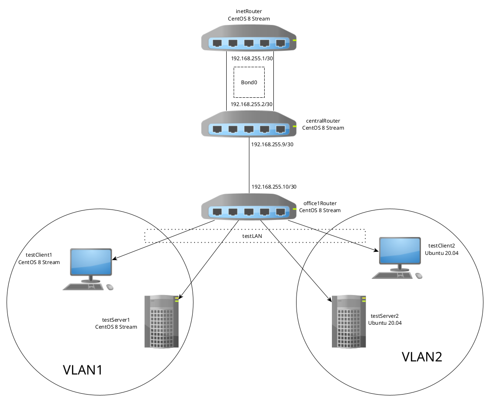

<h1>Сетевые пакеты. VLAN, LACP.</h1>

<b>Цель:</b> Научиться настраивать VLAN и LACP.

<a src='Vagrantfile'>Vagrantfile</a> - разворачивается 7 ВМ (5 на CentOS и 2 на Ubunut)

Топология сети, выделенных ВМ следующая:

<h2>Предварительная настройка</h2>

Перед настройкой VLAN и LACP установим на хосты следующие утилиты:

<ul>
    <li>vim</li>
    <li>traceroute</li>
    <li>tcpdump</li>
    <li>net-tools</li>
</ul>

<h2>Настройка VLAN на хостах</h2>

<h3>Настройка на RHEL-based</h3>

Для настройки хостов на основе RHEL создадим файл /etc/sysconfig/network-scripts/ifcfg-vlan1. (<a src='provisioning/templates/ifcfg-vlan1.j2'>ifcfg-vlan1</a>, параметры vlan_id и vlan_ip задаются в файле <a src='provisioning/templates/hosts'>hosts</a>)

Проверим настройку на серверах

<pre>[root@testClient1 vagrant]# ip -br a
lo               UNKNOWN        127.0.0.1/8 ::1/128 
eth0             UP             10.0.2.15/24 fe80::5054:ff:fe4d:77d3/64 
eth1             UP             fe80::7e5f:a88a:5778:57bb/64 
eth2             UP             192.168.56.21/24 fe80::a00:27ff:fefa:d69/64 
<b>eth1.1@eth1      UP             10.10.10.254/24 fe80::a00:27ff:fe4b:2c32/64 </b>
</pre>
<pre>[root@testClient1 vagrant]# ping 10.10.10.254 -c 4
PING 10.10.10.254 (10.10.10.254) 56(84) bytes of data.
64 bytes from 10.10.10.254: icmp_seq=1 ttl=64 time=0.035 ms
64 bytes from 10.10.10.254: icmp_seq=2 ttl=64 time=0.078 ms
64 bytes from 10.10.10.254: icmp_seq=3 ttl=64 time=0.081 ms
64 bytes from 10.10.10.254: icmp_seq=4 ttl=64 time=0.073 ms

--- 10.10.10.254 ping statistics ---
4 packets transmitted, 4 received, 0% packet loss, time 2999ms
rtt min/avg/max/mdev = 0.035/0.066/0.081/0.021 ms
</pre>

<h3>Настройка на Ubuntu</h3>

На хостах с Ubuntu создаем файл /etc/netplan/50-cloud-init.yaml (<a src='provisioning/templates/50-cloud-init.yaml.j2'>50-cloud-init.yaml</a>)

Проверяем

<pre>root@testClient2:/home/vagrant# ip -br a
lo               UNKNOWN        127.0.0.1/8 ::1/128 
enp0s3           UP             10.0.2.15/24 fe80::97:10ff:fe79:f0c1/64 
enp0s8           UP             fe80::a00:27ff:fe03:a3fd/64 
enp0s19          UP             192.168.56.32/24 fe80::a00:27ff:fe32:eb8f/64 
vlan2@enp0s8     UP             10.10.10.1/24 fe80::a00:27ff:fe03:a3fd/64 
root@testClient2:/home/vagrant# ping 10.10.10.1
PING 10.10.10.1 (10.10.10.1) 56(84) bytes of data.
64 bytes from 10.10.10.1: icmp_seq=1 ttl=64 time=0.053 ms
64 bytes from 10.10.10.1: icmp_seq=2 ttl=64 time=0.094 ms
64 bytes from 10.10.10.1: icmp_seq=3 ttl=64 time=0.110 ms
^C
--- 10.10.10.1 ping statistics ---
3 packets transmitted, 3 received, 0% packet loss, time 2097ms
rtt min/avg/max/mdev = 0.053/0.085/0.110/0.024 ms
</pre>

Все работает

<h2>Настройка LACP между inetRouter и centralRouter</h2>

Bond интерфейс будем настраивать через порты eth1 и eth2

<ul>
    <li>Добавим на обоих хостах конфигурационные файлы /etc/sysconfig/network-scripts/ifcfg-eth1 и /etc/sysconfig/network-scripts/ifcfg-eth2 (<a src='provisioning/templates/ifcfg-eth1'>ifcfg-eth1</a> и <a src='provisioning/templates/ifcfg-eth2'>ifcfg-eth2</a>) </li>
    <li>Настроим bond-интерфейс с помощью файла /etc/sysconfig/network-scripts/ifcfg-bond0 (<a src='provisioning/templates/ifcfg-bond0.j2'>ifcfg-bond0</a>)
    <li>После создания интерфейса перезапускаем сеть</li>
    <li>Проверим работу. Для этого запустим ping от inetRouter до centralRouter</li>
    <pre>[root@inetRouter vagrant]# ping 192.168.255.2
PING 192.168.255.2 (192.168.255.2) 56(84) bytes of data.
64 bytes from 192.168.255.2: icmp_seq=1 ttl=64 time=0.771 ms
64 bytes from 192.168.255.2: icmp_seq=2 ttl=64 time=0.486 ms
64 bytes from 192.168.255.2: icmp_seq=3 ttl=64 time=0.424 ms
</pre>

 И в это время отключим один порт на centralRouter

<pre>64 bytes from 192.168.255.2: icmp_seq=95 ttl=64 time=0.803 ms
64 bytes from 192.168.255.2: icmp_seq=96 ttl=64 time=0.749 ms
64 bytes from 192.168.255.2: icmp_seq=97 ttl=64 time=0.747 ms
64 bytes from 192.168.255.2: icmp_seq=98 ttl=64 time=0.807 ms
64 bytes from 192.168.255.2: icmp_seq=99 ttl=64 time=0.794 ms
64 bytes from 192.168.255.2: icmp_seq=100 ttl=64 time=0.594 ms
64 bytes from 192.168.255.2: icmp_seq=101 ttl=64 time=0.459 ms
64 bytes from 192.168.255.2: icmp_seq=102 ttl=64 time=0.462 ms
64 bytes from 192.168.255.2: icmp_seq=103 ttl=64 time=0.752 ms
64 bytes from 192.168.255.2: icmp_seq=104 ttl=64 time=0.739 ms
64 bytes from 192.168.255.2: icmp_seq=105 ttl=64 time=0.585 ms
64 bytes from 192.168.255.2: icmp_seq=106 ttl=64 time=0.717 ms
64 bytes from 192.168.255.2: icmp_seq=107 ttl=64 time=0.570 ms
</pre>

Можно увидеть, что пинги продолжают идти успешно. Все работает

</ul>