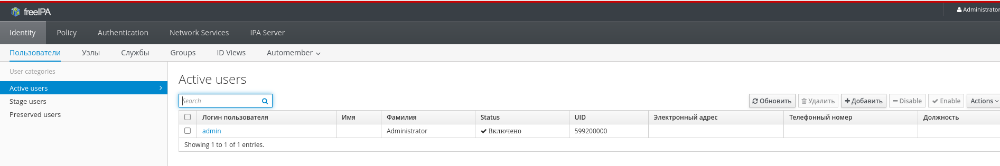

<h1>LDAP. Ц ентрализованная авторизация и аутентификация LDAP</h1>

<b>Цель:</b>

<ul>
    <li>Установить FreeIPA</li>
    <li>Сконфигурировать клиента с помощью Ansible</li>
</ul>

<a src='Vagrantfile'>Vagrantfile</a> - разворачивается 3 ВМ для демонстрации задания

<a src='playbooks'>playbook</a>- плэйбук и сопутствующая конфигурация для настройки серверов

<h2>Установка FreeIPA сервера</h2>

Вся настройка выполняется в плэйбуке <a src='playbooks/provision.yml'>provision.yml</a>. Выполняются следующие шаги.

<ul>
    <li>Установка часового пояса.</li>
    <li>Установка Chronyd</li>
    <li>Запустим Chrony и добавим его в автозагрузку</li>
    <li>Выключим firewall</li>
    <li>Выключим Selinux</li>
    <li>Так как у нас нет DNS-сервера, то добаваим запись с помощью <a src='playbooks/templates/ipa-hosts.j2'>/etc/hosts</a></li>
    <li>Установим FreeIPA-сервер</li>
    <li>На сервере запустим скрипт установки</li>
    <li>После удачной установки проверим, что Kerberos может выдать нам билет</li>
    <pre>[root@ipa vagrant]# kinit admin
Password for admin@OTUS.LAN: 
</pre>
    <pre>[root@ipa vagrant]# klist
Ticket cache: KEYRING:persistent:0:0
Default principal: admin@OTUS.LAN

Valid starting       Expires              Service principal
10/04/2023 00:55:37  10/05/2023 00:55:34  krbtgt/OTUS.LAN@OTUS.LAN
</pre>
    <li>Добавим в /etc/hosts хостовой машины запись о нашем сервере и зайдем на веб-страницу FreeIPA</li>
    
    <li>Если залогиниться, откроется косноль для управления FreeIPA. Данные можно вносить, как в консоль, так и с помощью командной строки.</li>
    
</ul>

На этом настройка сервера завершена

<h2>Конфигурция клиента</h2>

Настройка клиента во многом аналогична настройки сервера. И так как клинетов обычно намного больше, чем серверов, настройку произведем с помощью плэя. В частности, нам необходимо сделать следующее:

<ul>
    <li>Настроить синхронизацию времени и часовой пояс</li>
    <li>Настроить или выключить firewalld</li>
    <li>Настроить или выключить Selinux</li>
    <li>В /etc/hosts должна быть запись с FreeIPA-сервером</li>
</ul>

Проверим работу. Для этого создадим на сервере пользователя и попробуем залогиниться с ним на клиенте

<pre>------------------------
Added user &quot;sample-user&quot;
------------------------
  User login: sample-user
  First name: Nub
  Last name: User
  Full name: Nub User
  Display name: Nub User
  Initials: NU
  Home directory: /home/sample-user
  GECOS: Nub User
  Login shell: /bin/sh
  Principal name: sample-user@OTUS.LAN
  Principal alias: sample-user@OTUS.LAN
  User password expiration: 20231004002443Z
  Email address: sample-user@otus.lan
  UID: 599200001
  GID: 599200001
  Password: True
  Member of groups: ipausers
  Kerberos keys available: True
</pre>

 На клиенте:

<pre>[root@client1 vagrant]# kinit sample-user
Password for sample-user@OTUS.LAN: 
Password expired.  You must change it now.
Enter new password: 
Enter it again: 
</pre>

Система запросила праоль, и потребовала ввести новый, так как на сервере создается временный

После проделанных операций, добавление хостов к FreeIPA-выерверу завершен
