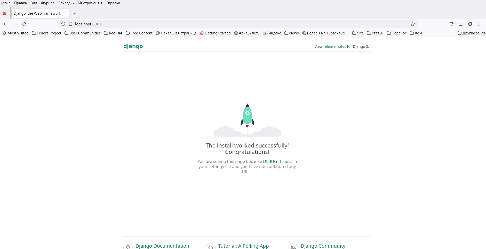
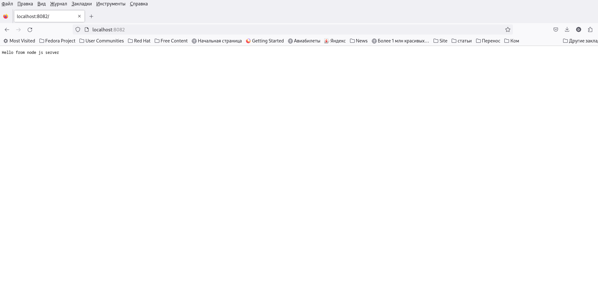
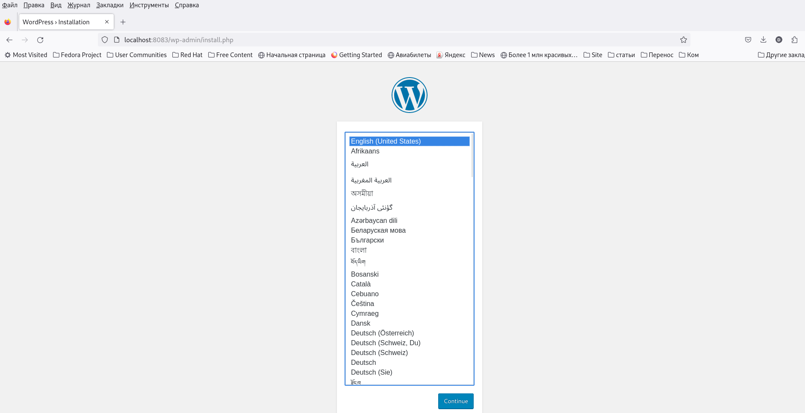

<h1>Динамический веб</h1>

<b>Цель:</b>Получить практические навыки в настройке инфраструктуры с помощью манифестов и конфигураций. Отточить навыки использования ansible/vagrant/docker.

<h2>Ход выполнения</h2>

Будем создавать стенд nginx+php-fpm(wordpress)+python(django)+js(node.js) с деплоем через docker-compose на ВМ, запускаемой в Vagrantfile

После создания ВМ и отработки плэя, на хостовой машине, будут доступны три странички на разных портах 8081 8082 и 8083

